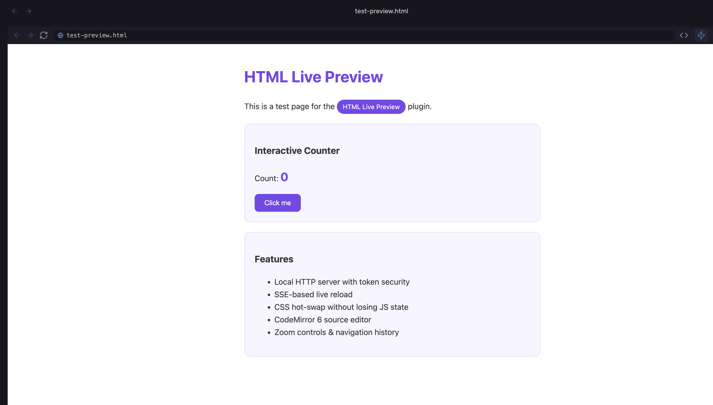
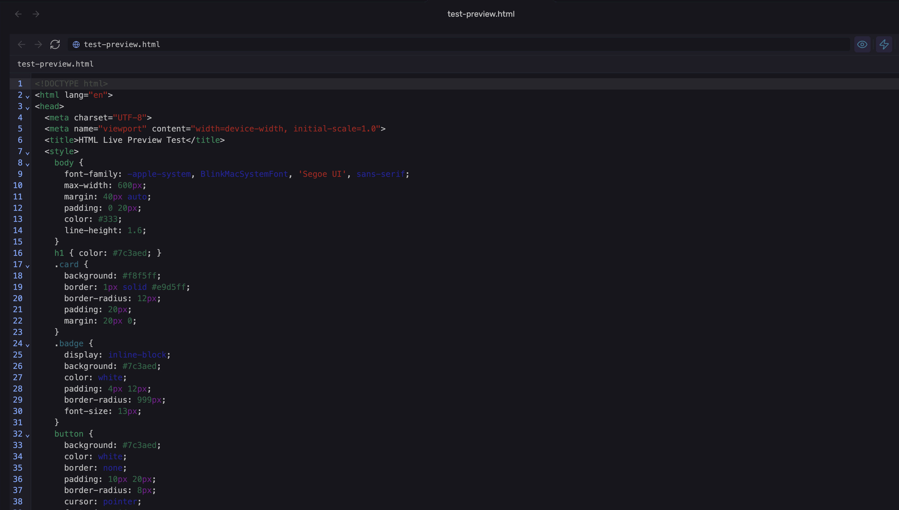

# HTML Live Preview for Obsidian

Preview HTML files directly inside Obsidian with full CSS, JavaScript, and CDN support — powered by a local HTTP server.



## Features

- **Full HTML rendering** — CSS, JavaScript, external CDN scripts all work out of the box
- **Local HTTP server** — Serves files from your vault via `http://127.0.0.1`, so relative paths resolve correctly
- **SSE-based live reload** — Automatically refreshes when you edit HTML, CSS, or JS files
- **CSS hot-swap** — CSS changes apply instantly without losing JavaScript state
- **Source editor** — Built-in CodeMirror 6 editor with HTML syntax highlighting, line numbers, and code folding
- **Browser-like toolbar** — Back/forward navigation, URL bar, reload, zoom controls, open in browser
- **Zoom controls** — 30% to 300% zoom with keyboard-friendly controls
- **Token-based security** — Random 32-byte token prevents unauthorized access to vault files
- **Path traversal protection** — Validates all file paths to prevent directory traversal attacks



## Installation

### Using BRAT (recommended for beta)

1. Install the [BRAT plugin](https://github.com/TfTHacker/obsidian42-brat) from Community Plugins
2. Open BRAT settings and click **Add Beta Plugin**
3. Paste: `https://github.com/thuongtin/obsidian-html-live-preview`
4. Enable the plugin in Settings > Community Plugins

### Manual

1. Download `main.js`, `manifest.json`, and `styles.css` from the [latest release](https://github.com/thuongtin/obsidian-html-live-preview/releases)
2. Create a folder: `<vault>/.obsidian/plugins/html-live-preview/`
3. Place the three files inside it
4. Restart Obsidian and enable the plugin in Settings > Community Plugins

## Usage

Click any `.html` or `.htm` file in the sidebar — it opens in a live preview tab.

**Toolbar controls:**
| Button | Action |
|--------|--------|
| `< >` | Navigate back/forward |
| Reload | Refresh the preview |
| URL bar | Click to copy the local server URL |
| `</>` | Toggle between preview and source editor |
| Zap | Toggle auto-reload on/off |
| `- / +` | Zoom out/in (click percentage to reset) |
| External link | Open in your default browser |

**Source editor:** Press `Cmd+S` (Mac) or `Ctrl+S` (Windows/Linux) to save changes. The preview updates automatically via live reload.

## Settings

| Setting | Default | Description |
|---------|---------|-------------|
| Allow scripts | On | Enable/disable JavaScript execution in previews |
| Default zoom | 100% | Default zoom level for new preview tabs |
| Show toolbar | On | Show/hide the navigation toolbar |
| Auto-reload | On | Automatically refresh on file changes |

## Security

- The server binds to `127.0.0.1` only — not accessible from other machines
- Each session generates a random 32-byte hex token; all requests must include it
- File paths are validated with `path.resolve()` to prevent directory traversal
- The iframe sandbox restricts what the previewed page can do

## Desktop only

This plugin requires Node.js APIs (`http`, `fs`, `path`, `crypto`) available in Obsidian's Electron runtime. It does not work on mobile.

## Development

```bash
git clone https://github.com/thuongtin/obsidian-html-live-preview.git
cd obsidian-html-live-preview
npm install
npm run build
```

Copy `main.js`, `manifest.json`, and `styles.css` to your vault's `.obsidian/plugins/html-live-preview/` folder.

## License

[MIT](LICENSE)
